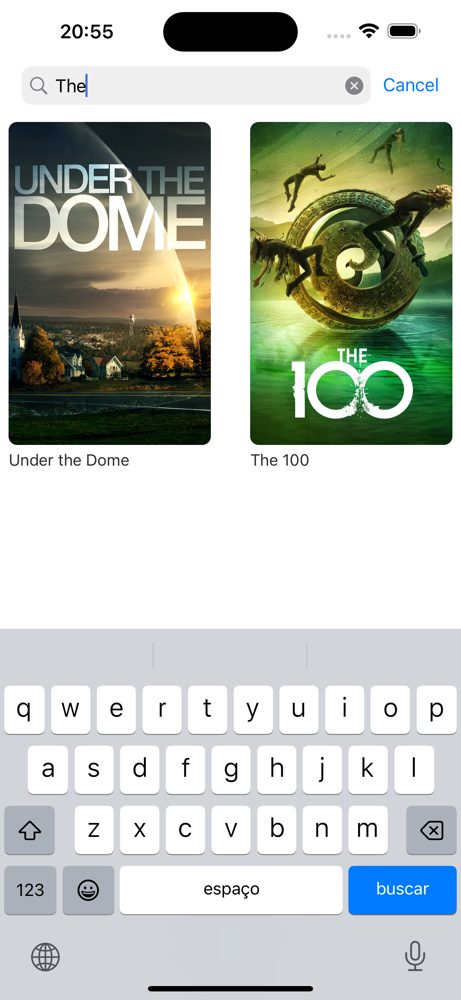
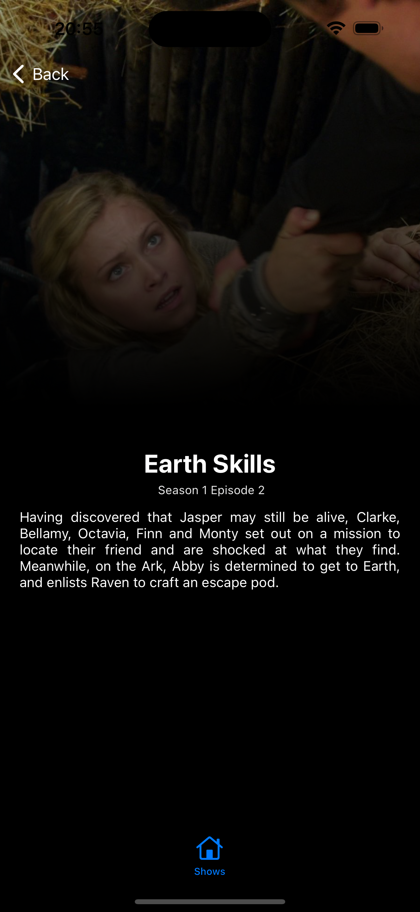

# ShowSpot App

## Setup
Just open the ShowSpot.xcworkspace and run...

## Show Feed Feature Specs
* The application should retrieve a list of shows from an API.
* The shows should be listed using a paging scheme provided by the API.

### Story: The customer requests to see the show feed in the app.

### Narrative #1

```
As an online customer
I want to be able to view the show feed available on the app,
So that I can explore and discover new shows.
```
#### Scenarios (Acceptance criteria)

```
Given the customer has connectivity
When the customer open the app or refresh the show feed,
Then the app should fetch and display the show feed.
```

## Use Cases

### Load Show Feed Use Case

#### Data:
- URL

#### Primary course (happy path):
1. Execute "Load Show Feed" command with above data.
2. System downloads data from the URL.
3. System validates downloaded data.
4. System creates show feed from valid data.
5. System delivers show feed.

#### Invalid data – error course (sad path):
1. System delivers invalid data error.

#### No connectivity – error course (sad path):
1. System delivers connectivity error.

---

## Model Specs

### Show

| Property      | Type                |
|---------------|---------------------|
| `id`          | `UUID`              |
| `name`        | `String`            |
| `image`       | `ImageObject`       |
| `schedule`    | `ScheduleObject`    |
| `genres`      | `[String]`          |
| `summary`     | `String`            |

### Show Image

| Property      | Type                |
|---------------|---------------------|
| `original`    | `URL`               |

### Show Schedule

| Property      | Type                |
|---------------|---------------------|
| `time`        | `String`            |
| `days`        | `[String]`          |


### Payload contract

```
GET /shows

200 RESPONSE

[
	{
		"id": "a UUID",
		"name": "a description",
        "image": {
            "original": "https://a-image.url"
        },
        "schedule": {
            "time": "22:00",
            "days": ["a given day", "another given day"]
        },
        "genres": ["a genre", "another genre"],
        "summary": "a sumary"
	},
	...
]

```
---

## Search Show Feature Specs

### Story: The customer wants to search for specific shows in the app.
* The application should allow users to search for shows by name.

### Narrative #1

```
As an online customer,
I want to be able to search for shows by their name,
So that I can easily find specific shows I'm interested in.
```
#### Scenarios (Acceptance criteria)

```
Given the customer has a stable internet connection,
When the customer enters the name of their favorite show,
Then the app should retrieve and display the shows in the show feed.
```

```
Given the customer has a slow internet connection,
When the customer enters the name of their favorite show,
Then the app should display a loading indicator to indicate that the search is in progress,
And once the information is retrieved, the app should populate the show feed with the shows.
```

```
Given the customer enters an invalid show name in the search bar,
When the customer submits the search query,
Then the app should display an error message indicating that the show was not found,
And the show feed should remain unchanged.
```

---

## View Show Details Feature Specs

### Story: The customer wants to view detailed information about a specific show.
* The application should display detailed information about a selected show.
* The details should include the show name, poster, airing days and time, genres, summary, and a list of episodes separated by season.

### Narrative

```
As an online customer,
I want to be able to view detailed information about a selected show,
So that I can learn more about the show and its episodes.
```

#### Scenarios (Acceptance criteria)

```
Given the customer has connectivity,
When the customer select a show from the show feed,
Then the app should display the details of the selected show,
Including the show name, poster, airing days and time, genres, summary, and a list of episodes grouped by season.
```

## Use Cases

### Load Show Episodes Use Case

#### Data:
- ShowID

#### Primary course (happy path):
1. Execute "Load Show Episodes" command with above data.
2. System loads data from remote service.
3. System validates data.
4. System creates show episodes from valid data.
5. System delivers show episodes.

#### Invalid data – error course (sad path):
1. System delivers invalid data error.

#### No connectivity – error course (sad path):
1. System delivers connectivity error.

---

## Model Specs

### Show Episode

| Property          | Type                    |
|-------------------|-------------------------|
| `id`              | `UUID`                  |
| `name` 	        | `String`			      |
| `season`          | `Int`                   |
| `number` 			| `Int`                   |
| `sumary` 			| `String`                |
| `image` 			| `ImageObject`           |

### Show Episode Image

| Property      | Type                |
|---------------|---------------------|
| `original`    | `URL`               |

### Payload contract

```
GET /shows/{show-id}/episodes

200 RESPONSE


[
	{
		"id": "a UUID",
		"name": "a name",
		"season": "1",
		"number": "1",
        "image": {
            "original": "https://a-image.url"
        },
        "sumary": "a sumary"
	},
	...
]
```

---

## App Architecture


## App Demo




